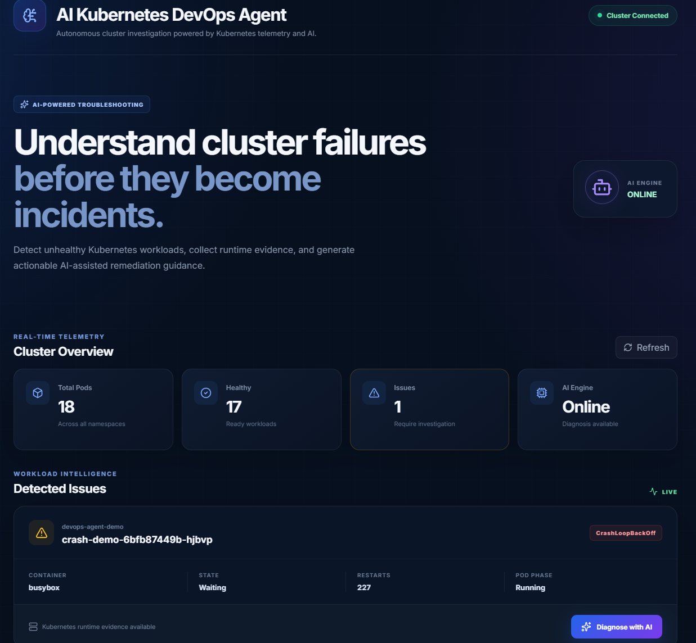
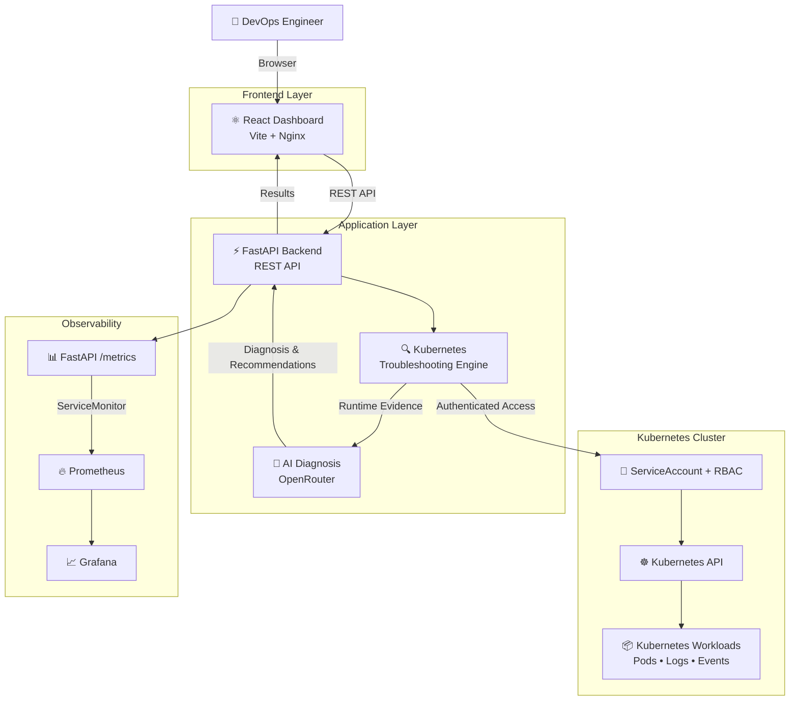
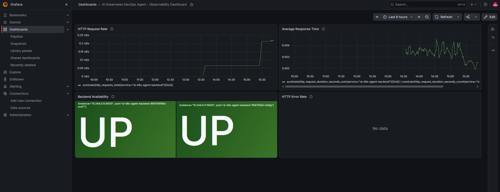

# 🤖 AI Kubernetes DevOps Agent

> An AI-powered Kubernetes troubleshooting platform that automatically detects unhealthy workloads, collects runtime evidence, analyzes failures, and provides actionable remediation guidance.



---

## 🚀 Overview

**AI Kubernetes DevOps Agent** is a cloud-native troubleshooting platform designed to help DevOps and platform engineers investigate Kubernetes workload failures faster.

The platform combines Kubernetes telemetry with AI-assisted analysis to detect unhealthy workloads, inspect pod status, logs, and events, and generate troubleshooting recommendations through an interactive web dashboard.

The application is built using **React, FastAPI, Docker, Kubernetes, OpenRouter AI, Prometheus, Grafana, GitHub Actions, and GitHub Container Registry (GHCR)**.

---

## ✨ Key Features

- ☸️ Kubernetes cluster integration
- 🔍 Automatic unhealthy workload detection
- 📋 Pod status, logs, and event collection
- 🤖 AI-assisted Kubernetes diagnosis
- 💡 Actionable remediation recommendations
- ⚡ FastAPI REST API
- ⚛️ Interactive React dashboard
- 🐳 Dockerized frontend and backend
- ☸️ Kubernetes-native deployment
- 🔐 ServiceAccount and least-privilege RBAC
- 🔑 Kubernetes Secret-based AI configuration
- ❤️ Readiness and liveness probes
- 📦 CPU and memory requests/limits
- 📊 Prometheus application metrics
- 📈 Grafana observability dashboard
- 🧪 Automated API testing with Pytest
- 🔄 GitHub Actions CI/CD
- 📦 Docker image publishing to GHCR

---

## 🏗️ Architecture



A detailed architecture description is available in:

`docs/architecture/architecture.md`

---

## 🔄 How It Works

1. The React dashboard communicates with the FastAPI backend.
2. The backend connects to the Kubernetes API using the Kubernetes Python client.
3. The troubleshooting engine identifies unhealthy workloads.
4. Pod status, container state, logs, and Kubernetes events are collected.
5. Relevant runtime evidence is provided to the AI diagnosis layer.
6. OpenRouter processes the Kubernetes context using the configured AI model.
7. Diagnosis and remediation guidance are returned to the frontend.
8. FastAPI exposes application metrics through `/metrics`.
9. Prometheus discovers and scrapes the backend through a `ServiceMonitor`.
10. Grafana visualizes application health and performance.

---

## 🖥️ Application Dashboard

The dashboard provides real-time Kubernetes workload visibility and AI-assisted troubleshooting.


The interface displays:

- Cluster connectivity
- Total Kubernetes pods
- Healthy workloads
- Detected issues
- AI engine availability
- Container state
- Pod restart count
- Pod phase
- Failure type
- AI diagnosis controls

---

## 🤖 AI-Powered Troubleshooting

When an unhealthy Kubernetes workload is detected, the platform collects runtime evidence including:

- Pod metadata
- Namespace
- Container state
- Pod phase
- Restart count
- Kubernetes events
- Container logs

This context is processed by the AI diagnosis layer to provide failure analysis and remediation guidance.

Example failure scenarios include:

- `CrashLoopBackOff`
- Container startup failures
- Repeated container restarts
- Application runtime failures
- Other unhealthy pod states

A demo `CrashLoopBackOff` workload is used to demonstrate the investigation workflow.

---

## 📊 Observability

The FastAPI backend exposes Prometheus-compatible metrics at:

```text
/metrics
```

Prometheus discovers the application through a Kubernetes `ServiceMonitor`.

Grafana provides visualization of backend health and application performance.



### Dashboard Metrics

The observability dashboard includes:

- **HTTP Request Rate**
- **Average Response Time**
- **Backend Availability**
- **HTTP Error Rate**

This provides visibility into application availability, traffic, latency, and errors.

---

## 🛠️ Technology Stack

| Category | Technologies |
|---|---|
| Frontend | React, Vite, JavaScript, Framer Motion, Lucide React |
| Web Server | Nginx |
| Backend | Python 3.12, FastAPI, Uvicorn |
| AI | OpenRouter |
| Kubernetes | Kubernetes, kind, kubectl |
| Kubernetes SDK | Python Kubernetes Client |
| Containers | Docker |
| Package Management | pip, npm |
| Security | Kubernetes RBAC, ServiceAccount, Secrets |
| Monitoring | Prometheus |
| Visualization | Grafana |
| Metrics | Prometheus FastAPI Instrumentator |
| Testing | Pytest, FastAPI TestClient |
| CI/CD | GitHub Actions |
| Container Registry | GitHub Container Registry (GHCR) |
| Source Control | Git, GitHub |

---

## 📁 Project Structure

```text
ai-kubernetes-devops-agent/
│
├── .github/
│   └── workflows/
│       └── ci.yml
│
├── backend/
│   ├── api/
│   ├── k8s/
│   ├── tests/
│   ├── main.py
│   ├── requirements.txt
│   └── Dockerfile
│
├── frontend/
│   ├── src/
│   ├── Dockerfile
│   ├── nginx.conf
│   ├── package.json
│   └── package-lock.json
│
├── k8s/
│   ├── namespace.yaml
│   ├── serviceaccount.yaml
│   ├── clusterrole.yaml
│   ├── clusterrolebinding.yaml
│   ├── backend-deployment.yaml
│   ├── backend-service.yaml
│   ├── frontend-deployment.yaml
│   ├── frontend-service.yaml
│   └── backend-servicemonitor.yaml
│
├── docs/
│   ├── architecture/
│   │   └── architecture.md
│   └── screenshots/
│       ├── application-dashboard.png
│       └── grafana-observability.png
│
└── README.md
```

---

## 🔌 API Endpoints

| Endpoint | Method | Description |
|---|---|---|
| `/health` | GET | Backend health check |
| `/api/cluster/pods` | GET | Retrieve Kubernetes pods |
| `/api/cluster/issues` | GET | Detect unhealthy workloads |
| `/api/cluster/diagnose/{namespace}/{pod_name}` | GET | Generate AI-assisted diagnosis |
| `/metrics` | GET | Prometheus application metrics |
| `/docs` | GET | FastAPI Swagger documentation |
| `/openapi.json` | GET | OpenAPI specification |

---

## ⚙️ Prerequisites

Install the following before running the complete platform:

- Docker
- Kubernetes
- `kubectl`
- `kind`
- Python 3.12+
- Node.js 22+
- npm
- Helm 3
- Git

An OpenRouter API key is required for AI-assisted diagnosis.

---

## 🚀 Local Development

### 1. Clone the Repository

```bash
git clone https://github.com/vardhana-devops/AI-Kubernetes-DevOps-Agent.git
cd AI-Kubernetes-DevOps-Agent
```

### 2. Backend Setup

```bash
cd backend

python3 -m venv venv
source venv/bin/activate

pip install -r requirements.txt
```

Create a local `.env` file:

```text
OPENROUTER_API_KEY=your_api_key_here
OPENROUTER_MODEL=nvidia/nemotron-3.5-lightning:free
```

> Never commit the `.env` file or API credentials to source control.

Start the backend:

```bash
uvicorn main:app --reload
```

Backend:

```text
http://localhost:8000
```

Swagger documentation:

```text
http://localhost:8000/docs
```

---

## ⚛️ Frontend Setup

Open another terminal:

```bash
cd frontend

npm install
npm run dev
```

The Vite development server will start locally.

---

## 🐳 Docker

Build the backend image:

```bash
docker build -t ai-k8s-agent-backend:latest ./backend
```

Build the frontend image:

```bash
docker build -t ai-k8s-agent-frontend:latest ./frontend
```

Verify:

```bash
docker images
```

---

## ☸️ Kubernetes Deployment with kind

### 1. Create the Cluster

```bash
kind create cluster --name ai-k8s-agent
```

Verify:

```bash
kubectl get nodes
```

### 2. Load Local Docker Images

```bash
kind load docker-image ai-k8s-agent-backend:latest --name ai-k8s-agent

kind load docker-image ai-k8s-agent-frontend:latest --name ai-k8s-agent
```

### 3. Create Namespace

```bash
kubectl apply -f k8s/namespace.yaml
```

### 4. Create the AI Secret

Create `backend/.env` locally with the required OpenRouter configuration.

Then:

```bash
kubectl create secret generic openrouter-secret \
  --from-env-file=backend/.env \
  -n ai-k8s-agent
```

Do not commit Kubernetes Secret values or the local `.env` file.

### 5. Deploy the Application

```bash
kubectl apply -f k8s/serviceaccount.yaml
kubectl apply -f k8s/clusterrole.yaml
kubectl apply -f k8s/clusterrolebinding.yaml
kubectl apply -f k8s/backend-deployment.yaml
kubectl apply -f k8s/backend-service.yaml
kubectl apply -f k8s/frontend-deployment.yaml
kubectl apply -f k8s/frontend-service.yaml
```

Verify:

```bash
kubectl get pods -n ai-k8s-agent
kubectl get services -n ai-k8s-agent
```

Expected application pods should reach:

```text
1/1 Running
```

### 6. Access the Application

```bash
kubectl port-forward service/ai-k8s-agent-frontend 8081:80 -n ai-k8s-agent
```

Open:

```text
http://localhost:8081
```

---

## 🔐 Kubernetes RBAC

The backend runs using a dedicated Kubernetes `ServiceAccount`.

A read-only `ClusterRole` grants access only to the Kubernetes resources required for troubleshooting:

```text
pods
pods/log
events
```

Allowed operations:

```text
get
list
watch
```

The application does not require `cluster-admin` privileges.

This follows the principle of least privilege.

---

## 🔑 Secret Management

AI credentials are injected into the backend through a Kubernetes Secret:

```text
openrouter-secret
```

The backend deployment consumes the secret through `envFrom`.

Sensitive `.env` files are excluded from Git and Docker build contexts.

---

## ❤️ Health Checks & Resource Management

The Kubernetes deployments include:

### Backend

- Readiness probe using `/health`
- Liveness probe using `/health`
- CPU requests and limits
- Memory requests and limits

### Frontend

- HTTP readiness probe
- HTTP liveness probe
- CPU requests and limits
- Memory requests and limits

These controls improve workload reliability and Kubernetes scheduling behavior.

---

## 📈 Prometheus & Grafana

The project uses `kube-prometheus-stack` for Kubernetes and application observability.

### Install Monitoring Stack

```bash
helm repo add prometheus-community https://prometheus-community.github.io/helm-charts
helm repo update

kubectl create namespace monitoring

helm install monitoring prometheus-community/kube-prometheus-stack \
  --namespace monitoring
```

### Deploy Application ServiceMonitor

```bash
kubectl apply -f k8s/backend-servicemonitor.yaml
```

### Prometheus

```bash
kubectl port-forward \
  service/monitoring-kube-prometheus-prometheus \
  9090:9090 \
  -n monitoring
```

Prometheus:

```text
http://localhost:9090
```

Example query:

```promql
up{service="ai-k8s-agent-backend"}
```

### Grafana

```bash
kubectl port-forward service/monitoring-grafana 3000:80 -n monitoring
```

Grafana:

```text
http://localhost:3000
```

Example application metrics:

```promql
sum(rate(http_requests_total{service="ai-k8s-agent-backend"}[5m]))
```

```promql
sum(rate(http_request_duration_seconds_sum{service="ai-k8s-agent-backend"}[5m]))
/
sum(rate(http_request_duration_seconds_count{service="ai-k8s-agent-backend"}[5m]))
```

```promql
up{service="ai-k8s-agent-backend"}
```

```promql
sum(rate(http_requests_total{service="ai-k8s-agent-backend",status=~"4..|5.."}[5m]))
```

---

## 🧪 Testing

Backend API tests are implemented using **Pytest** and FastAPI's test client.

Current tests validate:

- `/health`
- `/metrics`
- `/openapi.json`

Run the tests:

```bash
cd backend
source venv/bin/activate

PYTHONPATH=. pytest -v
```

Current result:

```text
3 passed
```

---

## 🔄 CI/CD Pipeline

GitHub Actions automatically validates the project for pushes and pull requests to `main`.

### Pipeline Flow

```text
Code Push / Pull Request
          │
          ├── Backend Validation
          │      ├── Install Python dependencies
          │      ├── Compile Python source
          │      └── Run Pytest
          │
          ├── Frontend Build
          │      ├── Install Node dependencies
          │      └── Build React application
          │
          └── Docker Build & Publish
                 ├── Build backend image
                 ├── Build frontend image
                 └── Publish to GHCR
```

Docker publishing occurs for pushes to the `main` branch after backend and frontend validation succeed.

---

## 📦 GitHub Container Registry

The CI/CD pipeline publishes versioned container images to GitHub Container Registry.

Images are tagged with:

```text
latest
```

and:

```text
Git commit SHA
```

This provides both a convenient latest image and traceability to the source commit used to build each container.

---

## 🛡️ Production-Oriented Engineering

The project demonstrates several cloud-native engineering practices:

- Containerized microservices
- Kubernetes-native deployments
- Git-based CI/CD
- Automated container image publishing
- Least-privilege RBAC
- Kubernetes Secret management
- Health probes
- Resource requests and limits
- Application metrics
- Prometheus service discovery
- Grafana visualization
- Automated API tests
- AI-assisted operational troubleshooting

---

## 🔮 Future Enhancements

Potential future improvements include:

- Additional Kubernetes failure scenarios
- Deployment and StatefulSet investigation
- Kubernetes node health analysis
- AI remediation confidence scoring
- Streaming Kubernetes events
- Historical incident storage
- Alertmanager integration
- Slack or Microsoft Teams notifications
- OpenTelemetry distributed tracing
- Authentication and authorization
- Helm chart packaging
- Horizontal Pod Autoscaling
- Cloud Kubernetes deployment to EKS, AKS, or GKE

---

## 🎯 Project Purpose

This project demonstrates practical experience across:

**Kubernetes • Docker • Python • FastAPI • React • AI Integration • REST APIs • RBAC • CI/CD • GitHub Actions • Prometheus • Grafana • Observability • DevOps Automation**

It was designed as a hands-on cloud-native engineering project demonstrating how AI can complement Kubernetes operational workflows and accelerate troubleshooting.

---

## 👩‍💻 Author

**Vardhana Seetala**

Cloud & DevOps Engineer

GitHub: `vardhana-devops`

---

## ⭐ Support

If you find the project useful, consider starring the repository.
