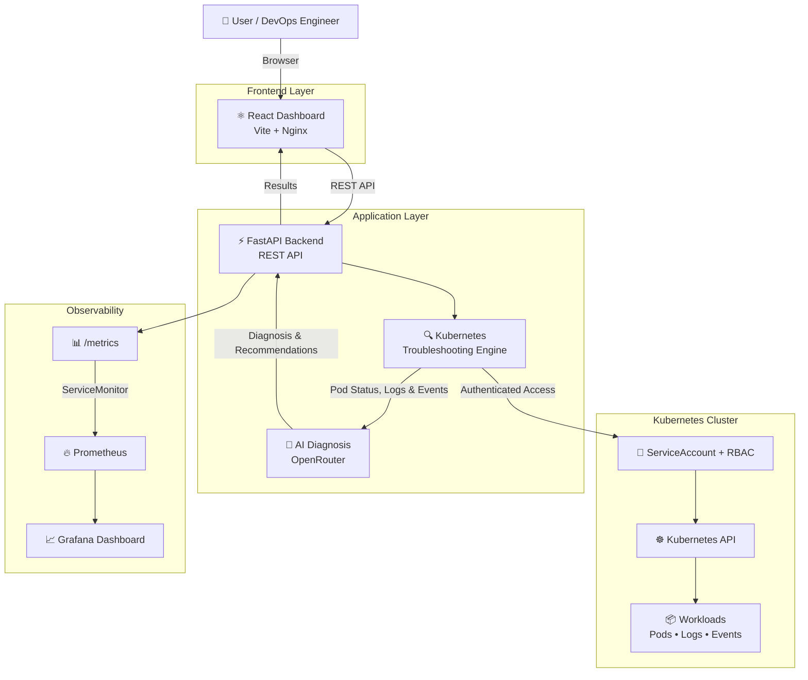

# AI Kubernetes DevOps Agent — Architecture

## System Architecture

The AI Kubernetes DevOps Agent combines Kubernetes workload inspection, automated troubleshooting, AI-assisted diagnosis, and observability into a single DevOps platform.

## Request Flow

1. A DevOps engineer opens the React dashboard.
2. Nginx serves the frontend and proxies API requests to the FastAPI backend.
3. The backend troubleshooting engine communicates with the Kubernetes API.
4. Kubernetes RBAC provides read-only access to pods, logs, and events.
5. The troubleshooting engine collects workload health information.
6. Relevant Kubernetes context is sent to the AI diagnosis layer through OpenRouter.
7. AI-generated analysis and remediation guidance are returned to the dashboard.
8. FastAPI exposes Prometheus metrics through `/metrics`.
9. Prometheus discovers the backend using a Kubernetes ServiceMonitor.
10. Grafana visualizes availability, request rate, response time, and HTTP errors.

## Architecture Highlights

- **Kubernetes-native deployment**
- **AI-assisted workload diagnosis**
- **Automated pod, log, and event investigation**
- **Least-privilege Kubernetes RBAC**
- **Kubernetes Secret-based AI credentials**
- **FastAPI REST backend**
- **React + Nginx production frontend**
- **Prometheus application metrics**
- **Grafana observability dashboards**
- **Readiness and liveness probes**
- **CPU and memory resource management**
- **Docker containerization**
- **GitHub Actions CI/CD**
- **GitHub Container Registry image publishing**
